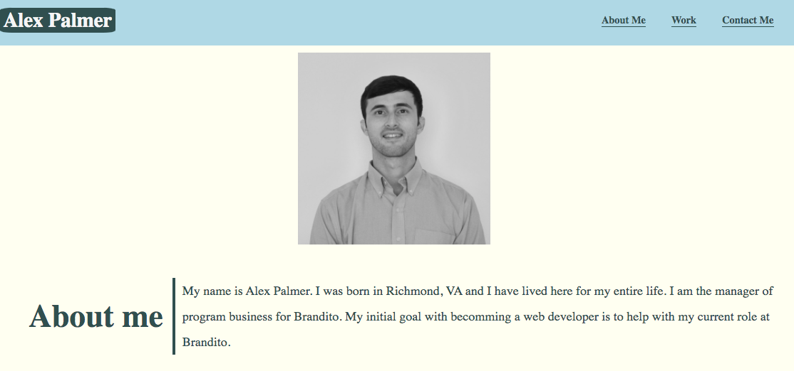
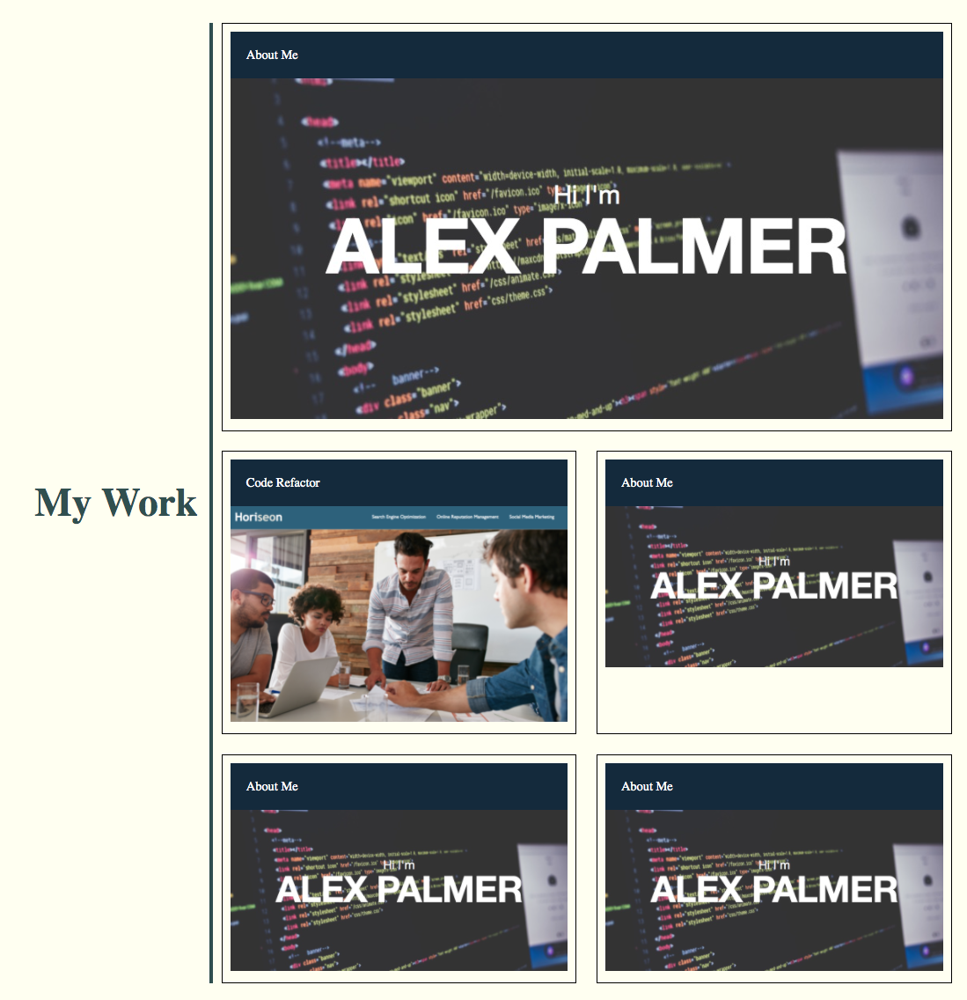
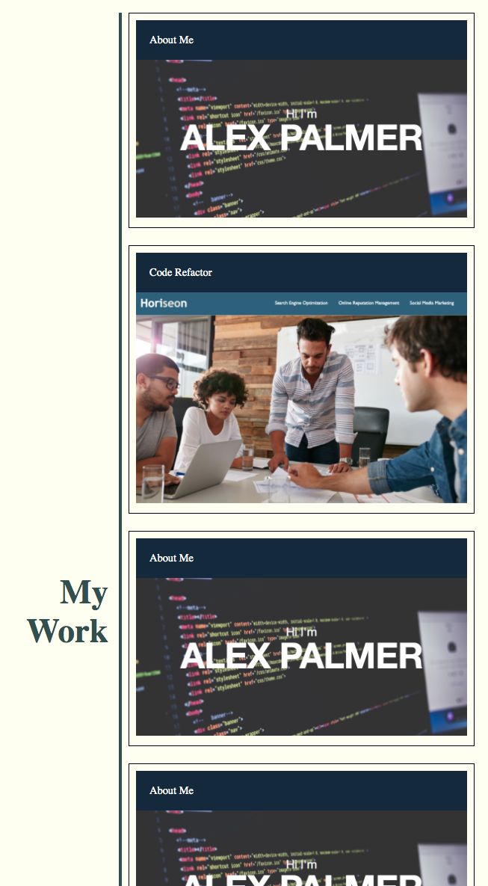
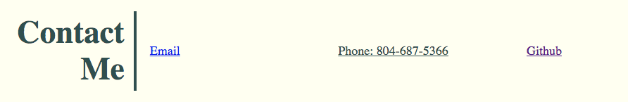

# AdvancedCSS_Portfolio_AlexPalmer

1. Description
2. Web Address
3. Usage Tips

Description:

This is the header, image, and about me.

This is the standard desktop screen for the "my work" section.

This is the "my work" section on a smaller screen.

This is the contact me page.

Web Address:
https://apalmer37.github.io/AdvancedCSS_Portfolio_AlexPalmer/

Usage Tips:
- Click on the navigation links at the top to visit different sections of my portfolio web page.

- Click on the images in the my work section to be directed to my other web pages.
